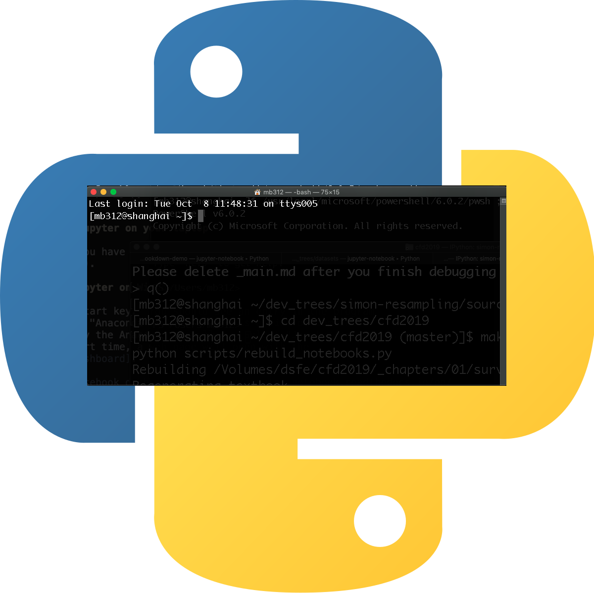

<div align=center>
    <h1>PyShell</h1>
</div>
<div align=center>
    </img>
</div>
<div align=center>
    Minimalistic Python shell.
</div>

## About

PyShell is a minimal Python shell. It is designed to be used as a drop-in replacement for your old shell (e.g. bash).

## Installation

Currently, PyShell is only available for POSIX systems (eg, linux and macos). The easiest way to install it is to use the install script:

(The install script requires python and curl and does not install it!)

```bash
curl -sL https://raw.githubusercontent.com/micziz/pyshell/main/install.sh | sh
```

## Usage

The best way to use PtShell is to ether run it from the command line adding an alias or exporting a path, or by setting it as you default shell by putting this line at the start of you zshrc/bashrc/bash_profile file:

```bash
python3 $HOME/pyshell.py
```

You can also call it directly without adding aliases or paths:

```bash
python3 pyshell.py
```

## Contributing

Contributions are welcome! Please read the contributions guide [here](contributing.md).

## License

Copyright 2022-present micziz

Licensed under the Apache License, Version 2.0 (the "License"); 
you may not use this file except in compliance with the License. 
You may obtain a copy of the License at:

http://www.apache.org/licenses/LICENSE-2.0

Or at the LICENSE file in the root of the project.

[LICENSE](LICENSE)

Unless required by applicable law or agreed to in writing, software 
distributed under the License is distributed on an "AS IS" BASIS, 
WITHOUT WARRANTIES OR CONDITIONS OF ANY KIND, either express or implied. 
See the License for the specific language governing permissions and 
limitations under the License.

## Code_Of_Conduct

This project follows a code of conduct. Please read [Code Of Conduct](code_of_conduct.md).

